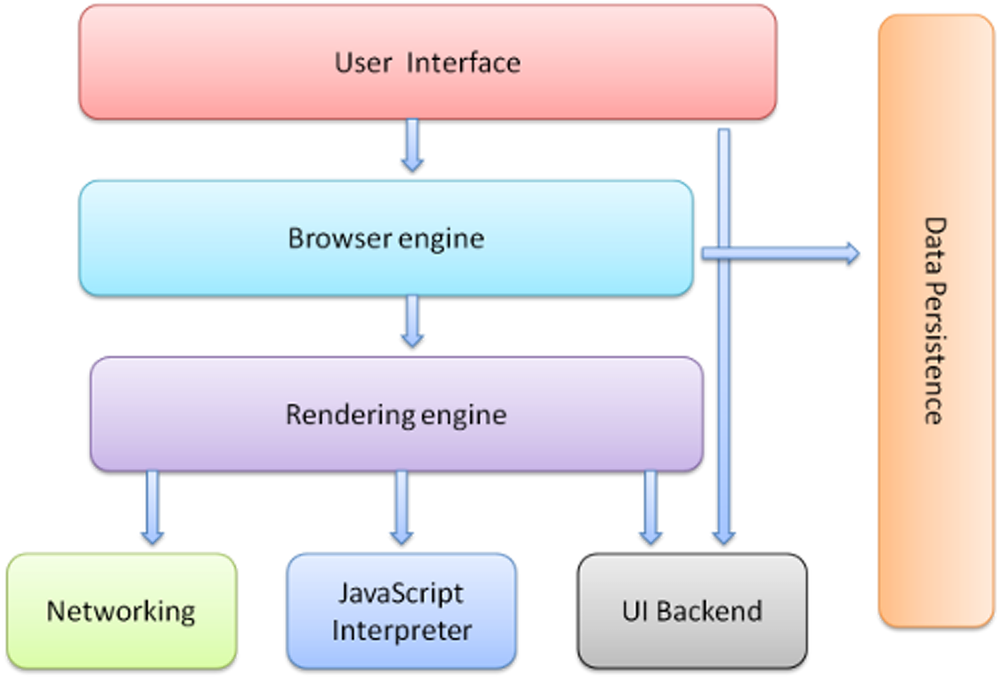

# Exercise 1.1

## 1. When a user enters an URL in the browser, how does the browser fetch the desiredresult ? Explain this with the below in mind and Demonstrate this by drawing a diagramfor the same.(2-3hours)

a. What is the main functionality of the browser?<br />
b. High Level Components of a browser.<br />
c. Rendering engine and its use.<br />
d. Parsers (HTML, CSS, etc)<br />
e. Script Processors<br />
f. Tree construction<br />
g. Order of script processing<br />
h. Layout and Painting<br />

## Solution

### Introduction

Web browsers are the most widely used software. In this primer, I will explain how they work behind the scenes. We will see what happens when you type google.com in the address bar until you see the Google page on the browser screen.<br /><br />

### The browsers we will talk about

There are five major browsers used on desktop today: Chrome, Internet Explorer, Firefox, Safari and Opera. On mobile, the main browsers are Android Browser, iPhone, Opera Mini and Opera Mobile, UC Browser, the Nokia S40/S60 browsers and Chromeall of which, except for the Opera browsers, are based on WebKit. I will give examples from the open source browsers Firefox and Chrome, and Safari (which is partly open source). According to StatCounter statistics (as of June 2013) Chrome, Firefox and Safari make up around 71% of global desktop browser usage. On mobile, Android Browser, iPhone and Chrome constitute around 54% of usage.<br /><br />

### The browser's main functionality

The main function of a browser is to present the web resource you choose, by requesting it from the server and displaying it in the browser window. The resource is usually an HTML document, but may also be a PDF, image, or some other type of content. The location of the resource is specified by the user using a URI (Uniform Resource Identifier).<br />
The way the browser interprets and displays HTML files is specified in the HTML and CSS specifications. These specifications are maintained by the W3C (World Wide Web Consortium) organization, which is the standards organization for the web. For years browsers conformed to only a part of the specifications and developed their own extensions. That caused serious compatibility issues for web authors. Today most of the browsers more or less conform to the specifications.<br />
Browser user interfaces have a lot in common with each other. Among the common user interface elements are:<br />

1. Address bar for inserting a URI
2. Back and forward buttons
3. Bookmarking options
4. Refresh and stop buttons for refreshing or stopping the loading of current documents
5. Home button that takes you to your home page
   <br /><br />

### The browser's high level structure

The browser's main components are:<br/>

1. **The user interface:** this includes the address bar, back/forward button, bookmarking menu, etc. Every part of the browser display except the window where you see the requested page.<br/>
2. **The browser engine:** marshals actions between the UI and the rendering engine.<br/>
3. **The rendering engine:** responsible for displaying requested content. For example if the requested content is HTML, the rendering engine parses HTML and CSS, and displays the parsed content on the screen.<br/>
4. **Networking:** for network calls such as HTTP requests, using different implementations for different platform behind a platform-independent interface.<br/>
5. **UI backend:** used for drawing basic widgets like combo boxes and windows. This backend exposes a generic interface that is not platform specific. Underneath it uses operating system user interface methods.<br />
6. **JavaScript interpreter:** Used to parse and execute JavaScript code.<br />
7. **Data storage:** This is a persistence layer. The browser may need to save all sorts of data locally, such as cookies. Browsers also support storage mechanisms such as localStorage, IndexedDB, WebSQL and FileSystem.<br />



_Figure: Browser Components_

It is important to note that browsers such as Chrome run multiple instances of the rendering engine: one for each tab. Each tab runs in a separate process.
<br /><br />

### The rendering engine

The responsibility of the rendering engine is well… Rendering, that is display of the requested contents on the browser screen.

By default the rendering engine can display HTML and XML documents and images. It can display other types of data via plug-ins or extension; for example, displaying PDF documents using a PDF viewer plug-in. However, in this chapter we will focus on the main use case: displaying HTML and images that are formatted using CSS.
<br /><br />

### Rendering engines

Different browsers use different rendering engines: Internet Explorer uses Trident, Firefox uses Gecko, Safari uses WebKit. Chrome and Opera (from version 15) use Blink, a fork of WebKit.

WebKit is an open source rendering engine which started as an engine for the Linux platform and was modified by Apple to support Mac and Windows. See webkit.org for more details.
<br /><br />

### Parsing

Parsing a document means translating it to a structure the code can use. The result of parsing is usually a tree of nodes that represent the structure of the document. This is called a parse tree or a syntax tree.

1. **HTML Parser:** The job of the HTML parser is to parse the HTML markup into a parse tree.
2. **CSS Parser:**
   <br /><br />

### The order of processing scripts

```
The model of the web is synchronous. Authors expect scripts to be parsed and executed immediately when the parser reaches a <script> tag. The parsing of the document halts until the script has been executed. If the script is external then the resource must first be fetched from the network - this is also done synchronously, and parsing halts until the resource is fetched. This was the model for many years and is also specified in HTML4 and 5 specifications. Authors can add the "defer" attribute to a script, in which case it will not halt document parsing and will execute after the document is parsed. HTML5 adds an option to mark the script as asynchronous so it will be parsed and executed by a different thread.
```

<br /><br />

### Layout

When the renderer is created and added to the tree, it does not have a position and size. Calculating these values is called layout or reflow.<br /><br />

HTML uses a flow based layout model, meaning that most of the time it is possible to compute the geometry in a single pass. Elements later "in the flow" typically do not affect the geometry of elements that are earlier "in the flow", so layout can proceed left-to-right, top-to-bottom through the document. There are exceptions: for example, HTML tables may require more than one pass.<br /><br />

Layout is a recursive process. It begins at the root renderer, which corresponds to the <html> element of the HTML document. Layout continues recursively through some or all of the frame hierarchy, computing geometric information for each renderer that requires it.<br/><br/>

The position of the root renderer is 0,0 and its dimensions are the viewport - the visible part of the browser window.
<br /><br />

### Painting

In the painting stage, the render tree is traversed and the renderer's "paint()" method is called to display content on the screen. Painting uses the UI infrastructure component.
